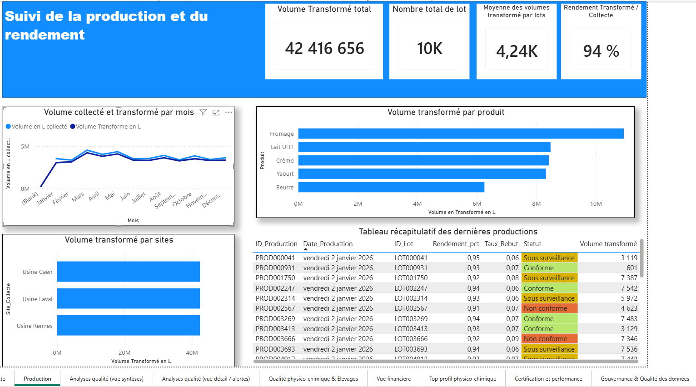
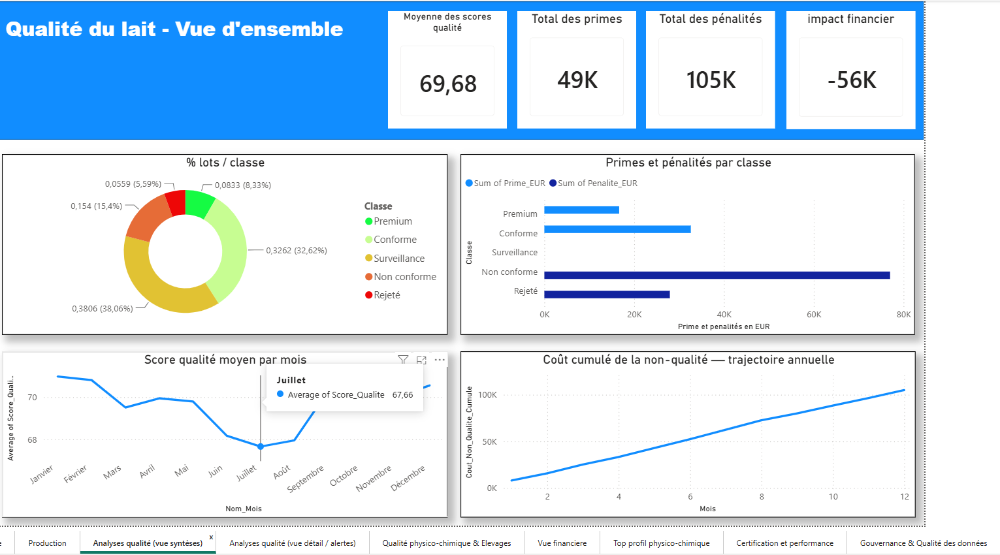
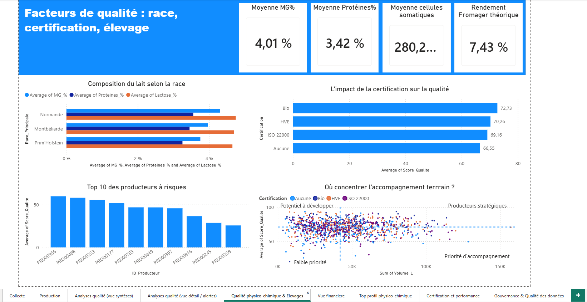
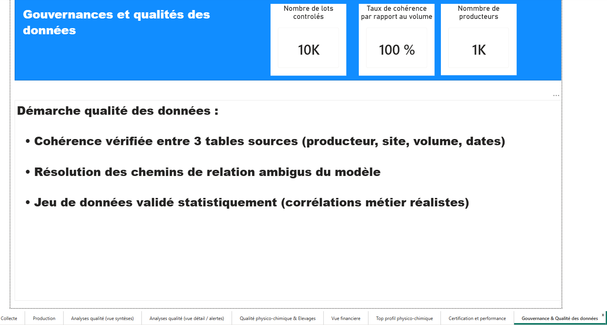

# Tableau de bord Power BI — Pilotage de la performance et de la qualité dans l'agroalimentaire laitier

Projet personnel réalisé dans le cadre de ma formation Data Analyst, appliqué à un environnement laitier simulé (≈10 000 lots, 1 000 producteurs, 3 sites de production).

## Objectif

Permettre le pilotage simultané de la collecte du lait, de la transformation en usine, de la qualité physico-chimique et sanitaire des lots, et de leurs conséquences financières (primes et pénalités).

## Aperçu

*Suivi de la production et du rendement*

*Répartition des lots par classe, impact financier et coût cumulé de la non-qualité*

*Effet de la race, de la certification, et matrice de priorisation des producteurs*

*Démarche de fiabilisation et de contrôle de cohérence des données*

## Démarche

- **Modélisation** : schéma en étoile (tables de faits Collectes / Production / Analyses_Qualite reliées aux dimensions Producteurs, Sites, Calendrier, Dimension_Classe), avec résolution de chemins de relations ambigus.
- **Power Query** : fusions de tables, colonnes conditionnelles, tri métier personnalisé des catégories qualité.
- **DAX** : plus de 30 mesures, incluant des fonctions avancées (`CALCULATE`, `ALL`, `TOPN`, `TREATAS`, `SELECTEDVALUE`) pour comparer des sous-ensembles de données (ex. meilleurs jours de production) à la moyenne globale, indépendamment des filtres de page.
- **Python (pandas, numpy)** : génération et enrichissement du jeu de données avec des corrélations métier réalistes (race bovine → composition du lait, certification/saisonnalité → score qualité, qualité → rendement de transformation).
- **Gouvernance des données** : contrôles systématiques de cohérence entre tables (identifiants de lot, volumes, dates), documentés dans une page dédiée du rapport.

## Pages du rapport

| Page | Contenu |
|---|---|
| Collecte | Volumes collectés, producteurs actifs, répartition par site |
| Production | Volumes transformés, rendement, suivi des lots |
| Analyses qualité (synthèse) | Répartition par classe, primes/pénalités, coût cumulé de la non-qualité |
| Analyses qualité (détail/alertes) | Suivi des non-conformités, causes de non-conformité |
| Qualité physico-chimique & Élevages | Effet race/certification, matrice de priorisation des producteurs |
| Vue financière | Chiffre d'affaires, prix au litre, rentabilité par produit |
| Top profil physico-chimique | Analyse comparative des meilleurs jours vs moyenne |
| Certification et performance | Impact de la certification sur la qualité et les volumes |
| Gouvernance & Qualité des données | Indicateurs de fiabilité et démarche méthodologique |

## Outils

Power BI · Power Query · DAX · Python (pandas, numpy) · Modélisation en schéma en étoile

## Fichier

Le fichier `.pbix` complet est disponible dans ce dépôt (à ouvrir avec Power BI Desktop).

---
**Paul Larsonneur** — Data Analyst
[Email](
paullarsonneur@gmail.com)
